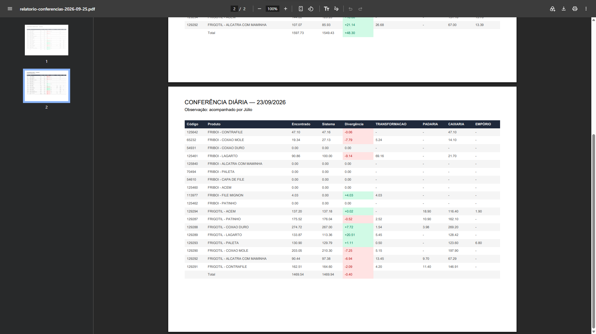
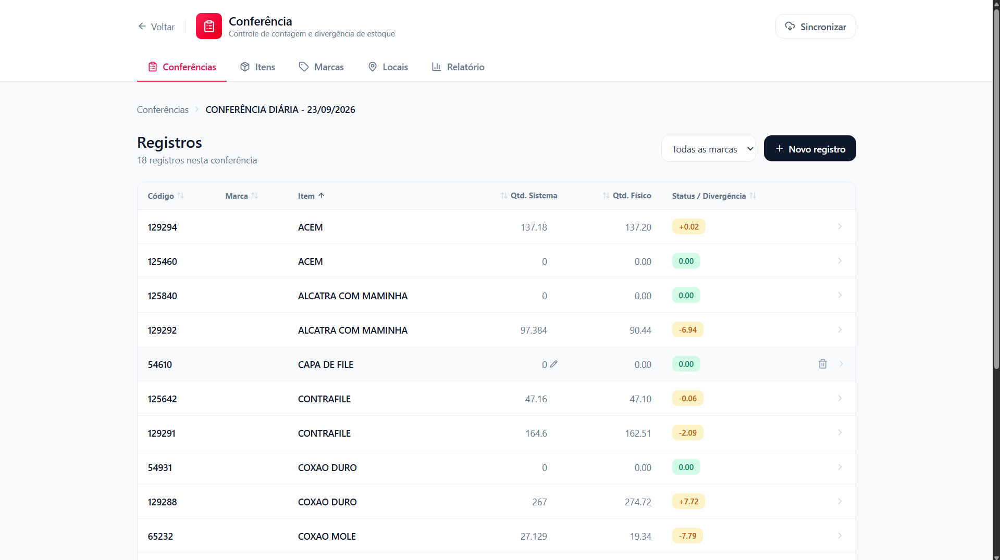
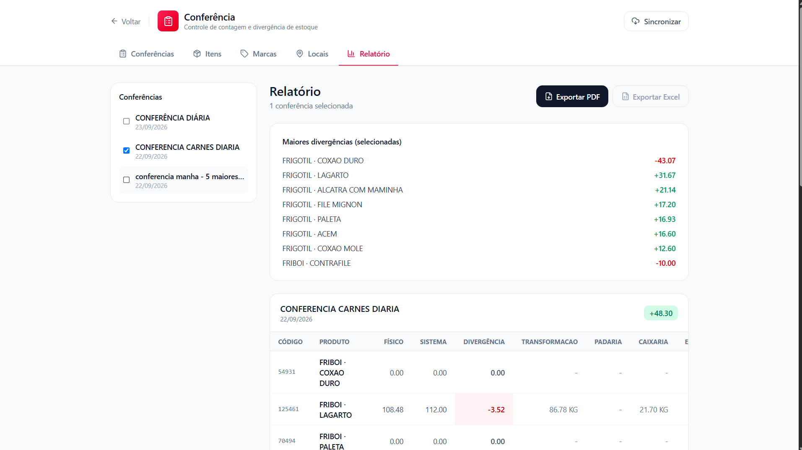

# Toolbox — Plataforma interna de gestão operacional (ainda em desenvolvimento)

Plataforma web (PWA) desenvolvida para centralizar ferramentas internas de operação, substituindo processos manuais por soluções digitais rastreáveis. O primeiro módulo implementado, **Conferência**, digitaliza o processo diário de conferência de estoque.

---

## O problema

O controle de estoque era feito através de **conferência diária manual, em papel e caneta**:

- Cada item era contado fisicamente e anotado à mão, por local (câmara fria, área de vendas, etc.)
- Os valores eram depois transcritos para planilhas, gerando **atraso entre a coleta e a análise**
- Anotações em papel eram facilmente **perdidas, rasuradas ou ilegíveis**
- **Não existia histórico estruturado** — comparar a divergência de um item ao longo de várias conferências exigia garimpar planilhas antigas, quando elas ainda existiam
- O cálculo de divergência (físico vs. sistema) era feito manualmente, item por item, sujeito a erro de conta

O resultado prático: decisões sobre bloqueio de valor por avaria e investigação de perdas recorrentes dependiam de dados que já chegavam atrasados, incompletos ou impossíveis de cruzar.

---

## A solução

Construí o **Toolbox**: uma plataforma web com arquitetura modular, pensada para hospedar múltiplas ferramentas internas ao longo do tempo — controle de acesso por rota e por cargo, painel administrativo, e um sistema de módulos independentes.

O primeiro módulo, **Conferência**, resolve o problema descrito acima:

- **Contagem digital por local**, com cálculo automático de tara por marca (desconto de peso de embalagem, considerando múltiplas caixas)
- **Divergência calculada automaticamente**, em tempo real, sem depender de planilha externa
- **Modelos de conferência**: itens recorrentes podem ser aplicados de uma vez a uma nova conferência, eliminando recadastro manual
- **Relatórios exportáveis em PDF**, com múltiplas conferências empiladas por data para comparação
- **Histórico completo e estruturado** de todas as conferências, consultável e filtrável a qualquer momento
- Os dados coletados alimentam **dashboards no Power BI**, permitindo identificar itens com divergência recorrente e apoiar decisões operacionais

---

## Stack técnica e decisões de arquitetura

| Frontend | React + TypeScript + Vite | Tipagem estática para reduzir erros em regras de negócio (cálculo de tara, divergência); build rápido |

| Estilo | Tailwind CSS |

| Backend / Banco | Supabase (PostgreSQL) | Banco relacional real, Row Level Security nativo, API REST automática |

| Autenticação e permissões | Supabase Auth + RLS | Controle de acesso por rota e por cargo, aplicado no nível do banco — não só na interface |

| Armazenamento local | Dexie (IndexedDB) | Necessário para o funcionamento offline (detalhado abaixo) |

| Geração de PDF | jsPDF + jsPDF-autotable | Relatórios exportáveis diretamente no navegador, sem backend dedicado |

| Análise de dados | Power BI | Camada de BI conectada aos dados operacionais coletados pelo módulo |

### Por que offline-first

A operação acontece no chão de fábrica, onde a conexão de internet não é garantida — câmaras frias e áreas de estoque nem sempre têm sinal estável. Um sistema que dependesse de conexão contínua **pararia a operação**, que é exatamente o problema que o papel resolvia (por pior que fosse).

A solução foi desenhar a aplicação como **offline-first de verdade**, não como um PWA com cache superficial:

1. **Toda escrita é local primeiro.** Ao registrar uma contagem, o dado é salvo imediatamente no IndexedDB do dispositivo — a interface nunca espera resposta de rede para considerar a ação concluída.
2. **Fila de sincronização (padrão outbox).** Cada escrita local gera uma entrada numa fila de pendências. Enquanto não há conexão, os itens acumulam sem bloquear o uso do app.
3. **Sincronização sob controle do usuário.** Um botão dedicado envia as pendências para o Supabase quando há conexão disponível, com feedback visual de quantos itens aguardam envio.
4. **Detecção de conexão real**, não apenas o evento do navegador — o app testa se o servidor está de fato alcançável antes de tentar sincronizar, evitando falhas silenciosas em redes instáveis.
5. **Tratamento de conflito e erro**, com retry automático e mensagens de erro quando uma sincronização falha.

Esse desenho garante que a pessoa fazendo a conferência físico nunca é interrompida por falta de internet — o mesmo problema que o papel "resolvia", mas agora sem perder rastreabilidade, histórico ou precisão de cálculo.

---

## Resultado

- Eliminação do papel no processo de conferência diária
- Divergência calculada automaticamente, sem erro de conta manual
- Histórico completo e consultável, permitindo identificar padrões de perda ao longo do tempo
- Dados estruturados alimentando análises em Power BI, algo impossível no processo anterior
- Sistema funcional mesmo em áreas sem conexão de internet confiável

---

## Autor

Desenvolvido por Caio Carvalho — stack principal em React/TypeScript/Supabase.